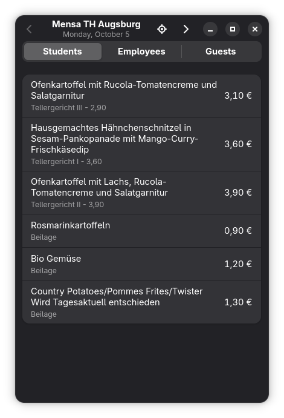
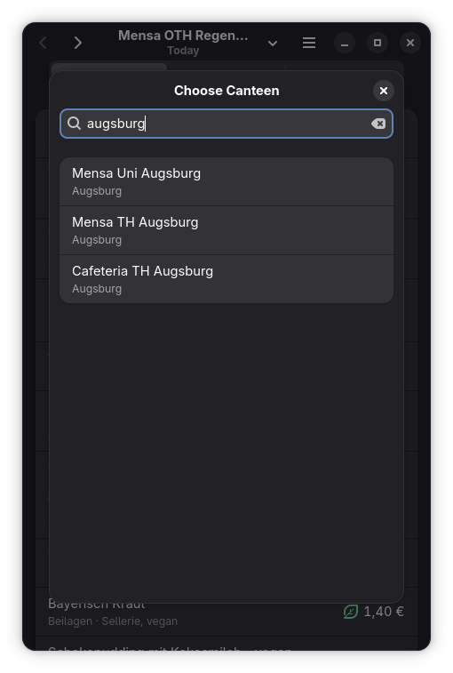

<div align="center">
  
  <h1>Lunch Tray</h1>
  <p>See what's on the menu at your canteen.</p>
</div>

Lunch Tray is a native GNOME app for the menus of all canteens listed on [OpenMensa](https://openmensa.org). It is written in Rust with GTK 4, libadwaita and relm4.

<p align="center">
  
  
</p>

## Features

- Menus of more than 1300 canteens, searchable by name or city
- Browse the days of the week
- Prices for students, employees and guests
- Remembers your canteen and price group
- Shows the last saved menu when you are offline
- Allergen and dietary notes, with icons for vegan and vegetarian meals (where the canteen provides them)

## Keyboard Shortcuts

| Shortcut | Action |
|---|---|
| <kbd>Alt</kbd>+<kbd>←</kbd> / <kbd>Alt</kbd>+<kbd>→</kbd> | Previous / next day |
| <kbd>Ctrl</kbd>+<kbd>Q</kbd> | Quit |

## Building

Lunch Tray needs GTK 4.22 and libadwaita 1.9 (GNOME 50). On Ubuntu 26.04:

```bash
sudo apt install libgtk-4-dev libadwaita-1-dev
cargo run
```

## Installing for your user

```bash
./install-local.sh
```

This builds a release binary and installs it together with its desktop file and icons to `~/.local`, so Lunch Tray shows up in the GNOME overview. Run it again after pulling changes. To uninstall, delete `~/.local/bin/lunch-tray`, `~/.local/share/applications/de.jukromer.LunchTray.desktop` and the two `de.jukromer.LunchTray` icons under `~/.local/share/icons/hicolor/`.

## Building the Flatpak

Needs `org.flatpak.Builder`, `org.gnome.Sdk//50` and `org.freedesktop.Sdk.Extension.rust-stable//25.08` from Flathub.

```bash
flatpak run org.flatpak.Builder --force-clean --user --install build-dir de.jukromer.LunchTray.yml
flatpak run de.jukromer.LunchTray
```

If the build stops with `Failure spawning rofiles-fuse`, add `--disable-rofiles-fuse` after `--force-clean`.

The build runs offline, so `cargo-sources.json` has to be regenerated whenever `Cargo.lock` changes:

```bash
flatpak run --command=flatpak-cargo-generator org.flatpak.Builder Cargo.lock -o cargo-sources.json
```

## Status

Early development. The Flatpak builds locally and the Flathub submission is in preparation. Planned next: a filter for vegetarian meals and a nicer layout.

## Data

Menus come from the [OpenMensa API](https://docs.openmensa.org/api/v2/). Lunch Tray is not affiliated with OpenMensa.

## License

Lunch Tray is licensed under the GPL-3.0-or-later, see [LICENSE](LICENSE). The symbolic icons (cutlery, leaf and egg) are from the GNOME Icon Development Kit by Jakub Steiner (CC0).
